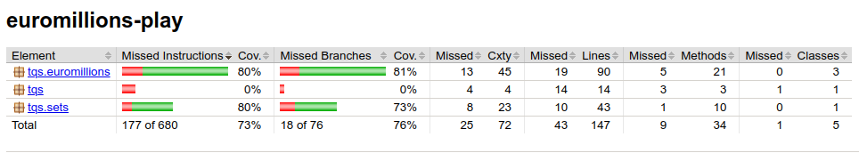
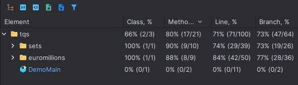
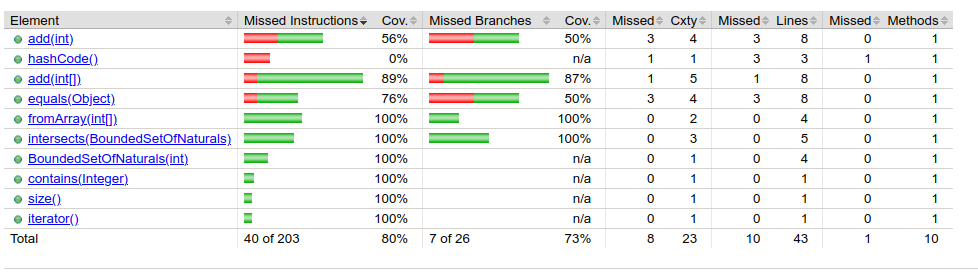
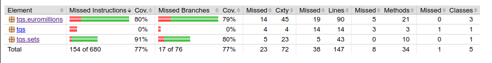
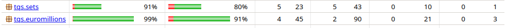

# Lab 1 Notes

## 1.1
### j) Considering the previous point, can you think of a scenario where the TqsStack will fail despite the high coverage level? To which extent can one rely on code coverage to assess quality of your code?

One possible failure scenario is when the stack is empty and the user tries to pop an element. Code coverage is useful to ensure all methos are tested, however, it is not a guarantee that all code paths are tested, and therefore shouldn't be taken as a reliable indicator of code quality.

## 1.2

### Assessing the coverage of a project using JaCoCo

`mvn clean test jacoco:report`
This command will generate a report in the `target/site/jacoco` directory.

it is also runnable using intelIj feature: Run with coverage

### d) Are there more unit test are worth writing for proper validation of BoundedSetOfNaturals?

I think there could be added edge and boundary cases
The report also indicates that add methods could be covered better, as well as of the fact that the hashcode method is not being tested

After the new tests, these are the results:

Afteer futher aditions, this is the end result:

