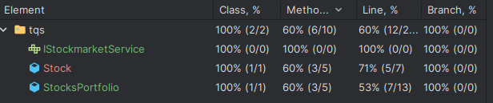
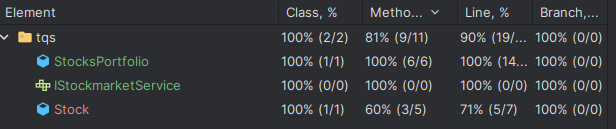

# Lab 2 Notes

## 2.1
After the tests of ai, the coverage presented was 

I then added more tests to get the coverage to 100%, excluding the Stock.java file, since its methods were very simple and didn't require any testing.

