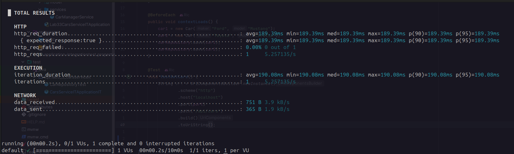

# Lab 7 - Non Functional Testing
## 7.1 k6 Tool

### Install k6

```
sudo gpg -k
sudo gpg --no-default-keyring --keyring /usr/share/keyrings/k6-archive-keyring.gpg --keyserver hkp://keyserver.ubuntu.com:80 --recv-keys C5AD17C747E3415A3642D57D77C6C491D6AC1D69
echo "deb [signed-by=/usr/share/keyrings/k6-archive-keyring.gpg] https://dl.k6.io/deb stable main" | sudo tee /etc/apt/sources.list.d/k6.list
sudo apt-get update
sudo apt-get install k6
```
### Run docker compose
```docker compose up```

### Run k6 test

```k6 run test.js```



### Stats
##### How long did the API call take?
- 189.39ms
##### How many requests were made?
- 1
##### How many requests failed? (i.e., whose HTTP status code was not 200)
- There were 0 failed requests (0.00% failure rate).