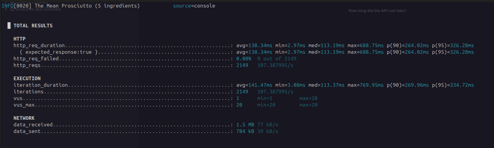

# Lab 7 - Non Functional Testing
## 7.2 Results Monitoring

### Run docker compose
```docker compose up`````

### Run k6 test

```k6 run test.js```



### Stats
##### How long did the API call take?
138.34ms
##### How many requests were made?
2149
##### How many requests failed?
0.00%  0 out of 2149